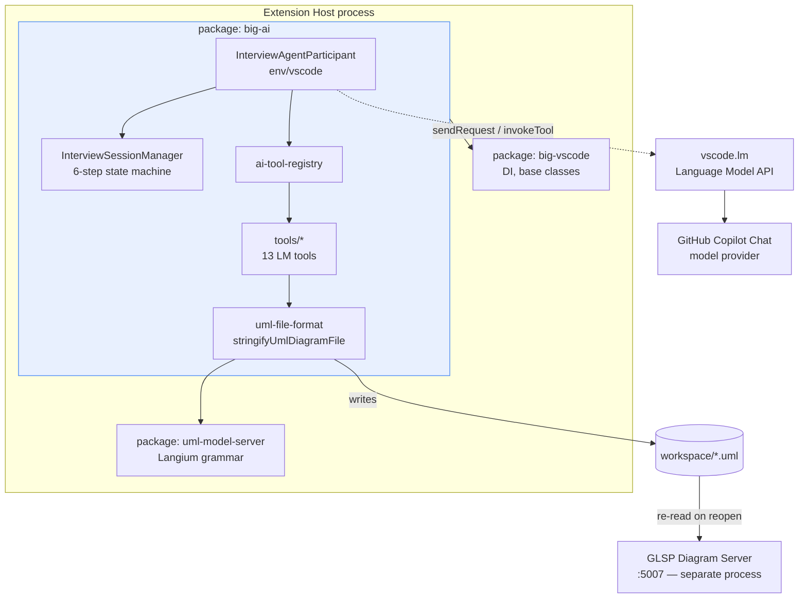
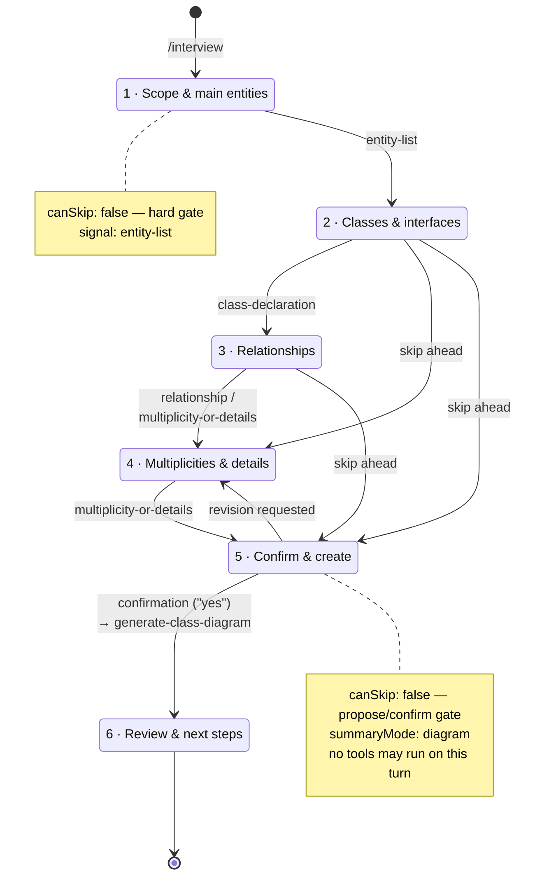

# big-ai — Technical Report

## 1. Overview

`big-ai` is the AI-integration package of the bigUML VS Code extension. It registers a VS Code Chat
Participant (`@biguml`) backed by the built-in VS Code Language Model API, so a user can create and edit
UML diagrams by chatting instead of clicking through the GLSP diagram editor. It lives at
`client/packages/big-ai` in the Lerna monorepo, alongside the diagram editor packages (`big-vscode`,
`uml-glsp-client`, `uml-glsp-server`, `uml-model-server`, `uml-language`).

## 2. Running it

**Prerequisites.** Node v24.14.0 (`nvm use`; the `.nvmrc` pins it — CI still uses Node 20, a known
discrepancy) and a signed-in **GitHub Copilot Chat** installation in the VS Code instance you debug with.
`big-ai` does not talk to any model vendor directly: it goes through VS Code's built-in Language Model API
(`vscode.lm`), which brokers the request to whatever chat model Copilot exposes to extensions. No API key
lives in this repo.

**Build and launch.**

```bash
cd client
nvm use
npm run setup      # first time: npm ci → build:tooling → generate → build
npm run watch      # leave running during development
```

Open **`client/`** as the VS Code workspace root (not the repo root), then Run and Debug → **Launch
Extension**. The extension host opens `client/workspace/` as its scratch workspace. In the Chat panel, type
`@biguml /interview` to start. After changing extension code, reload the extension host window (`Ctrl+R`).

**Model selection.** Two settings control which model the participant talks to:

| Setting | Default | Effect |
|---|---|---|
| `bigUML.ai.modelVendor` | `copilot` | Which VS Code LM vendor to request a model from. |
| `bigUML.ai.modelFamily` | *(empty)* | Preferred family, e.g. `gpt-4o` or `claude-3.5-sonnet`. Empty = any model of that vendor. |

Resolution follows a fallback chain: if a family is configured, `selectModel()` asks for that exact
`{ vendor, family }` pair; if the family isn't installed it falls back to any model of the configured vendor
and logs the downgrade to the `big-ai` output channel. If the vendor has no models at all — Copilot missing
or unauthenticated, in the default configuration — the participant fails fast with a `MODEL_UNAVAILABLE`
error rather than silently substituting another vendor. Both settings live in
`application/vscode/package.json` and are read in `interview-agent.participant.ts`.

**Chat session target.** Keep the chat panel's **Set Session Target** on **Local**. `@biguml` is registered
into the extension-hosted session, and participant stickiness only works there (see §5).

**Where things live.** `src/env/vscode/interview-agent.participant.ts` is the request entrypoint,
`interview-session-manager.ts` owns the 6-step state machine, and `src/env/vscode/tools/*` holds one file per
LM tool. To add a tool: implement it under `tools/`, register it in `ai-tool-registry.ts`, and declare it in
`application/vscode/package.json` → `contributes.languageModelTools` (all three are required — a tool missing
from the manifest is never offered to the model).

## 3. What was done

- A chat participant (`InterviewAgentParticipant`, `interview-agent.participant.ts`) that supports four
  slash commands: `/interview` (guided requirements gathering), `/modify` (edit an existing diagram),
  `/explain` (UML/OOP Q&A), and `/plan` (report interview progress). Only the first three are declared in
  `application/vscode/package.json`'s `chatParticipants.commands`, so `/plan` never appears in the chat
  command picker — it works when typed and is offered as a follow-up chip, but it is undiscoverable
  otherwise.
- A **step-based interview flow** (`interview-session-manager.ts`) that walks the user through 6 fixed
  steps for class-diagram creation: (1) scope & main entities, (2) classes/interfaces, (3) relationships,
  (4) multiplicities & remaining details, (5) confirm & create, (6) review/next steps. Each step has a
  `policy` (`canSkip`, `advancementSignals`, `summaryMode`) that governs whether/how it can be
  skipped and what triggers moving to the next step.
- A **tool-calling architecture**: the model itself never writes UML directly. Instead it calls
  registered `vscode.lm` tools, and the extension writes/edits the `.uml` file. Tools registered in
  `ai-tool-registry.ts`: `propose-diagram`, `confirm-generation`, `generate-class-diagram`,
  `generate-deployment-diagram`, `complete-interview-step`, `create-uml-file`, `read-uml-file`,
  `add-node`, `add-class-member`, `remove-node`, `add-relation`, `remove-relation`.
- A **propose/confirm gate**: the model calls `proposeDiagram` with a full spec, the extension
  deterministically renders the summary (`formatProposalSummary`) rather than trusting the model to
  describe its own proposal, and only generates the diagram after an explicit `confirmGeneration` /
  step-5 "yes".
- **Diagram file I/O** goes through a Langium-grammar-based serializer (`uml-file-format.ts`,
  `stringifyUmlDiagramFile`) instead of raw `JSON.stringify`, so every write is round-trip-validated
  against the actual UML grammar before hitting disk.
- **Parser-safe naming** (`tool-utils.ts`, `toParserSafeName`): user-supplied names with spaces/punctuation
  (e.g. "date of birth") are normalized to camelCase identifiers, because the Langium grammar's `ID`
  terminal doesn't accept whitespace and a raw string would silently break round-trip parsing.
- **Chat anchors**: after generating or modifying a diagram, the chat response includes a clickable
  `stream.anchor()` link to the `.uml` file, and the extension force-reopens the diagram editor tab so the
  GLSP server re-reads the file fresh (`announceGeneration`/`openDiagram` in the participant).
- **Chat references & active-diagram auto-attach**: explicit `#file`/`#selection` chat references are read
  and injected as labeled context messages; the currently-open `.uml` editor is auto-attached (with its
  workspace-relative path) so the model can act on "this diagram" without the user re-stating the path.
- **Model access via the VS Code Language Model API** (`vscode.lm.selectChatModels`), so the package never
  holds an API key or talks to a vendor directly. Vendor and model family are configurable via
  `bigUML.ai.modelVendor` / `bigUML.ai.modelFamily`, with a fallback to any model of the configured vendor
  when the requested family isn't installed (§2).
- **Model choice turned out to matter more than expected — the agent is only as reliable as the model
  driving it.** Cheaper models (e.g. GPT-4o) *can* produce good diagrams, but the higher-tier models (e.g.
  Claude Sonnet) were noticeably more reliable in the parts of the flow that depend on disciplined
  instruction-following rather than raw modelling ability: emitting a well-formed tool call instead of
  hand-writing UML into the chat, respecting the "exactly one question per turn" rule, and honouring the
  step-5 gate that forbids tool calls on the summary turn. Weaker models drift out of the protocol more
  often, and because the extension deliberately doesn't trust model prose (§4), a model that ignores the
  tool contract simply produces nothing.
- **In practice most of the team could not choose a model at all.** GitHub Copilot changed its student
  licensing during the project, which left most of us restricted to Copilot's **auto mode** — Copilot picks
  the model per request and the extension takes what it is handed. This is a real limit on the settings
  described in §2: `bigUML.ai.modelFamily` can only pin a family that the vendor actually exposes to
  extensions, so under auto mode the setting has little or nothing to select from, and the effective model
  may vary from request to request. It also undercuts the comparison above — it is part of why the
  reliability observations are only our impressions, since we could not hold the model fixed across runs.
- A deterministic follow-up provider (`provideFollowups`) that suggests next actions (accept/revise
  summary, add entities, show progress, etc.) as clickable chips under each response.

## 4. How it's solved (architecture)

### Package structure

`big-ai` is a leaf package: it depends on `big-vscode` (DI/base classes) and `uml-model-server` (the Langium
grammar it serialises against), and nothing depends on it. It exposes two entrypoints via its `exports` map
(`.` = common, `./vscode` = extension host) and lives entirely in the Extension Host process — it has no
`glsp-server` or `glsp-client` env folder.



### Request flow

```
 VS Code Chat UI  ──▶  InterviewAgentParticipant.handleRequest()
                          │
                          ├─ parseCommand()            → /interview | /modify | /explain | /plan | default
                          ├─ InterviewSessionManager    → tracks 6-step state, drafts, skip policy
                          ├─ buildSystemMessage()       → SYSTEM_PROMPT + mode context + step instructions
                          │                                + attached references + active diagram
                          └─ model.sendRequest(messages, { tools: allowedToolNames })
                                    │
                                    ▼
                          LanguageModelToolCallPart(s)
                                    │
                                    ▼
                          vscode.lm.invokeTool(name, input)  ──▶  packages/big-ai/src/env/vscode/tools/*
                                    │                                  │
                                    │                                  ├─ resolveWorkspacePath / toParserSafeName
                                    │                                  └─ stringifyUmlDiagramFile (Langium round-trip)
                                    ▼
                          stream.markdown(...) + stream.anchor(uri) + openDiagram(uri)
```

### Interview state machine

`InterviewSessionManager` walks a fixed 6-step list. Each step carries a `policy`: `canSkip` (steps 1, 5 and
6 are hard gates), `advancementSignals` (which classified user utterance moves it forward), and
`summaryMode`. A step advances when the model calls `complete-interview-step` with a matching signal; steps
2–4 may be skipped ahead when the user front-loads information, but a skip attempt on a locked step is
rejected with that step's `skipBlockedMessage`.



Key design decisions:
- **Tool-driven, not free-text generation.** The model is never trusted to hand-write UML/JSON; every
  mutation goes through a typed tool with its own validation. This is why `generate-class-diagram.tool.ts`
  and friends exist as separate, independently invokable tools rather than one big "write this diagram"
  prompt.
- **Deterministic rendering over model-authored text.** Proposal summaries (`formatProposalSummary`) and
  step headers (`buildStepHeader`) are built by the extension from structured tool input, not by asking
  the model to describe what it just did — this avoids the model's prose drifting from what was actually
  written to disk.
- **A session-scoped state machine** (`InterviewSessionManager`) sits alongside the stateless VS Code chat
  turn model, because a single interview spans many chat turns and VS Code's `ChatContext.history` alone
  isn't a convenient place to track step progress, drafts, and skip eligibility.
- **History is token-budgeted, not turn-counted** (`selectHistoryWindow`): recent turns are included
  newest-first until ~50% of the model's input window is spent, so long interviews keep their early
  requirements instead of being cut off at a fixed turn count.

## 5. Problems encountered

- **Langium grammar vs. free-form names.** The UML grammar's `ID` terminal rejects spaces/punctuation, but
  users naturally type "date of birth" as a property name. Fixed via `toParserSafeName()` normalizing to
  camelCase before every write.
- **Silent write corruption.** Some tools originally wrote diagrams with raw `JSON.stringify` instead of
  the grammar-validated serializer, so a malformed write could pass silently and only fail later when the
  diagram server tried to re-parse it. Fixed by routing all mutating tools through
  `stringifyUmlDiagramFile()`.
- **Diagram staleness after file writes.** Tools write directly to the `.uml` file on disk, but the GLSP
  diagram server caches an in-memory model — so edits didn't show up in an already-open diagram until the
  editor was forced to reopen (`openDiagram()` closes then reopens the tab).
- **Chat rendering quirks.** Sequential `stream.markdown()` calls that are meant to render as one
  continuous block show up with no blank line between them in the VS Code chat UI, even when the source
  string ends in `\n\n` — the renderer appears to trim each part's leading/trailing whitespace before
  stitching parts together.
- **Chat participant stickiness depends on the "Set Session Target" selection.** VS Code keeps `@biguml`
  selected as the active chat participant across turns via the declarative `isSticky: true` field in
  `application/vscode/package.json`'s `chatParticipants` contribution. This works correctly when the chat
  panel's **Set Session Target** is set to **Local** (the standard extension-hosted session `@biguml` is
  registered into), but stickiness is lost when the target is switched to **Copilot CLI** — the user has to
  re-select `@biguml` on every turn in that mode; no working fix for the Copilot CLI case exists yet.

## 6. What's missing / known gaps

- **File-write grammar check is syntax-only, not semantic.** All mutating tools write the `.uml` file
  directly via `stringifyUmlDiagramFile()`, which only re-parses the result and checks for parser errors —
  it doesn't run Langium's linker/scoping or any custom validators, so a diagram that parses but is
  semantically wrong (e.g. a dangling reference) can still slip through. GLSP operations narrow this a bit
  for edges (the create-edge handler resolves both endpoints and throws if either is missing), but that's
  incidental to how it builds references, not a deliberate validation layer, and node creation/deletion have
  no equivalent check — so this is at best a partial mitigation, not a fix.
- **Human-readable names are lost (upstream grammar limit, issue #40).** The Langium `LANGIUM_ID` terminal
  rejects spaces/dots, so `toParserSafeName()` slugs "Frontend Server" → `frontendServer`. This is a
  pre-existing bigUML bug, not a `big-ai` one — the plain diagram editor's label-edit path corrupts files the
  same way (no validator bound) — but `big-ai` hits it constantly, since an LLM naturally produces
  human-readable names. A real fix needs a quoted-name terminal plus escaping in `tooling/uml-language*`, and
  must also cover the reference terminal (`[Node:LANGIUM_ID]`), since names double as cross-reference keys.
- **Deployment-diagram support is disconnected from the interview flow.** The system prompt, the
  `GenerateDeploymentDiagramTool`, and the `DeploymentNodeType`/`DeploymentRelationType` types all still
  exist and work if invoked directly, but the step-based `InterviewSessionManager` only has class-diagram
  steps and no CLASS-vs-DEPLOYMENT branching — so `/interview` cannot currently walk a user through
  creating a deployment diagram end-to-end, even though the model is told it can.

## 7. Future work

- **Expose the UML tools over MCP instead of `vscode.lm` tool calls.** Today every tool is registered
  through VS Code's proprietary Language Model Tool API: declared in `contributes.languageModelTools`, bound
  in `ai-tool-registry.ts`, and invocable only from inside this extension host, by whatever model Copilot
  Chat happens to hand us. Re-exposing the same tool surface as an **MCP server** would decouple the UML
  operations from the chat client entirely — the same `add-node` / `add-relation` / `generate-class-diagram`
  tools could then be driven by Claude Code, a standalone agent, or CI, and the tool contracts would be
  testable without booting an extension host. The natural split is an MCP server owning the model
  operations, with the participant reduced to a thin chat front-end over it. The tools are already typed and
  side-effect-isolated, so the port is mostly transport plumbing rather than a redesign.
- **Revisit whole-file generation once tool calling is reliable.** A finding worth recording: generating the
  **entire diagram in one `generate-class-diagram` call after the interview** worked substantially better
  than having the model call `create-uml-file` → `add-node` → `add-class-member` → `add-relation` one after
  another. The incremental path failed in ways that were hard to recover from: models dropped or reordered
  calls mid-sequence, retried a partially-applied step, or stopped early, each of which leaves a
  half-written `.uml` file on disk with no transaction to roll back. The single-call path is atomic — one
  spec in, one round-trip-validated write out, nothing on disk if it fails — which is why `/interview` funnels
  into it. The tradeoff is that it can only *replace* whole diagrams, so genuinely incremental edits
  (`/modify`) still need the per-element tools and still carry that fragility. If MCP (or better tool-calling
  models) makes multi-call sequences dependable, the incremental path becomes the better design; until then
  the atomic write is the pragmatic choice. Worth benchmarking rather than assuming — the failure rate that
  motivated this was observed anecdotally during manual QA, not measured.
- **Adopt GLSP operations for mutating tools instead of direct file writes.** Every mutating tool
  (`add-node`, `add-class-member`, `add-relation`, `remove-node`, `remove-relation`,
  `generate-class-diagram`) writes the `.uml` file directly today and relies on `openDiagram()`'s
  close/reopen hack to refresh an open diagram. `extension.client.ts` already registers GLSP operation
  commands for this (`createNode`/`deleteElement`/`createEdge`/`createMember`), but none are currently
  called by any tool. Wiring the tools through them (falling back to a file write when no client is
  attached) would let the open diagram update live instead of needing the close/reopen hack, and would make
  edits syntax-safe by construction instead of relying on the file-write path's re-parse check. It would
  not fully close the semantic gap noted in §5 though — deliberate semantic validation would still need to
  be added on top.
- Design and wire deployment-diagram steps into `InterviewSessionManager` (or make diagram-type a
  first-class branch at step 1, with two parallel step lists).
- Consider automated tests around the tool layer (round-trip serialize/parse, parser-safe-name edge cases)
  — currently verified manually per `INTERVIEW_GENERATION_TESTING.md`.

## Feedback and Recommendations

### What worked well

The **propose/confirm gate** is the most critical design decision and is working as intended. Separating
the plan turn (`proposeDiagram`) from the execute turn (`confirmGeneration` → `generateClassDiagram`)
avoids the partial-write failures that plagued earlier incremental tool sequences and makes the flow
easy to reason about. This gate should be preserved for any future diagram-type extensions.

The **6-step session manager** gives the interview a predictable structure. The explicit `policy`
objects per step (`canSkip`, `advancementSignals`, `summaryMode`) mean the flow can be modified without
touching the main request handler.

The **tool-layer isolation** — one file per tool with its own validation and Langium round-trip check
— is the right architecture. Tools are independently testable and can later be re-exposed over MCP (§7)
with minimal restructuring.

### What should be improved

- **The close/reopen diagram hack is fragile.** `openDiagram()` closes then reopens the editor tab to
  force the GLSP server to re-read the file, which causes a visible flicker and depends on tab lifecycle
  behavior that may change. The GLSP operation commands already registered in `extension.client.ts`
  (`createNode`, `deleteElement`, `createEdge`, `createMember`) are the right replacement — wiring the
  mutating tools through them (with a file-write fallback) would make live diagram updates reliable.
- **Step-machine coverage should be extended to activity diagrams.** Activity and deployment requests
  currently fall back to the single-pass flow because the step prompts are written in class-diagram
  language. Activity diagrams have enough structure (swimlanes, decision branches, parallel paths) that
  a guided step-by-step interview would meaningfully improve output quality.
- **Automated tests are missing.** The tool layer (`uml-file-format.ts` round-trips,
  `toParserSafeName()` edge cases) and the session manager's step-advancement logic are well-suited for
  unit tests but are currently verified only manually per `INTERVIEW_GENERATION_TESTING.md`.
